# 🚀 Argo CD on k3d — Setup Guide
This guide documents the steps followed to install and configure Argo CD on a k3d (K3s-in-Docker) Kubernetes cluster.
It includes cluster creation, Argo CD installation, connecting a Git repository, and deploying an example NGINX application through GitOps.

# 📂 Project Structure
```
├── README.md                # This documentation
├── cluster-config.yaml      # k3d cluster configuration (1 master + 2 agent nodes)
├── nginx-manifests/         # Kubernetes manifests for the NGINX application
│   ├── deployment.yaml
│   └── service.yaml
└── screenshots/             # All screenshots referenced in this README
    ├── add_git_repository.png
    ├── configure_connect_repository.png
    ├── healthy_synced_app.png
    ├── manual_sync_status.png
    ├── argo_dashboard_land_page.png
    ├── create_application.png
    ├── initial_outofsync.png
    ├── repo_connect_successful.png
    ├── argo_dashboard_login_page.png
    ├── enter-app-name-proj-name-for-new-app.png
    ├── kubectl_result_after_sync.png
    └── set-source-destination-for-app.png
```

# ✅ Folder Descriptions
- **cluster-config.yaml** – Defines the k3d cluster layout (server + agents).
- **nginx-manifests/** – Contains Kubernetes manifests for the NGINX app deployed via Argo CD.
- **screenshots/** – Contains all UI screenshots used throughout this README.
- **README.md** – Setup instructions.

--------------------------------------------------------------------------------------------

## ✅ 1. Install Required Tools
Make sure the following tools are installed:

```
- Docker Desktop
- kubectl
- k3d
- (Optional) Argo CD CLI
```

## ✅ 2. Create the Kubernetes Cluster
### 2.1 Create the cluster
```
$ k3d cluster create argo-cluster --config cluster-config.yaml
```

### 2.2 Verify cluster access
```
$ kubectl get nodes
```

✅ If you face issues with host.docker.internal in kubeconfig on Windows, replace it manually with 127.0.0.1.

## ✅ 3. Install Argo CD

### 3.1 Create namespace
```
$ kubectl create namespace argocd
```
### 3.2 Install Argo CD
```
$ kubectl apply -n argocd \  --server-side --force-conflicts \  -f https://raw.githubusercontent.com/argoproj/argo-cd/stable/manifests/install.yaml
```
### 3.3 Verify
```
$ kubectl get po -n argocd
```

## ✅ 4. Access the Argo CD UI

### 4.1 Port-forward the API server
```
$ kubectl port-forward svc/argocd-server -n argocd 8080:443
```
### 4.2 Open the UI
https://localhost:8080

### 4.3 Login screen
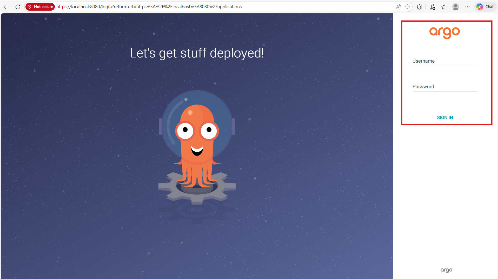

## ✅ 5. Login to Argo CD
Retrieve the default admin password:
```
$ kubectl get secret argocd-initial-admin-secret -n argocd \  -o jsonpath={.data.password} | base64 -d
```
Dashboard home page:
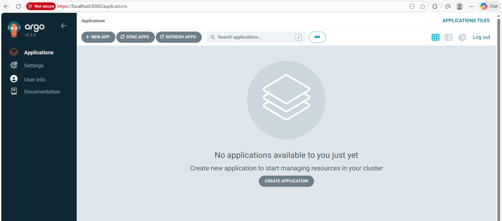

## ✅ 6. Connect Git Repository to Argo CD
### 6.1 Navigate to:
Settings → Repositories
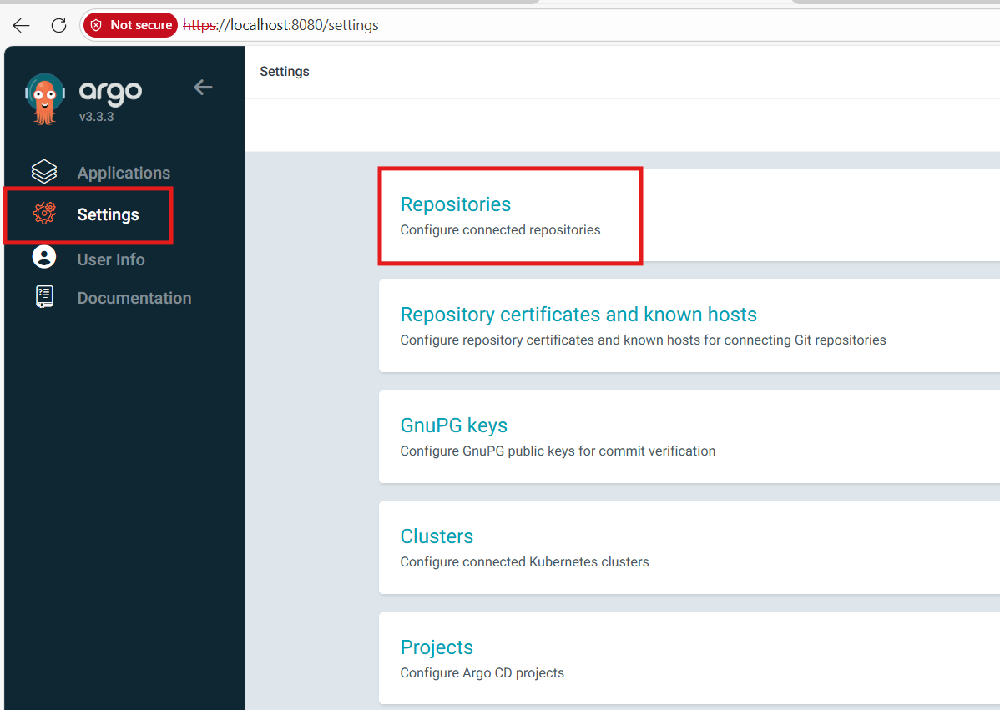
### 6.2 Add your Git repository
Add repository:
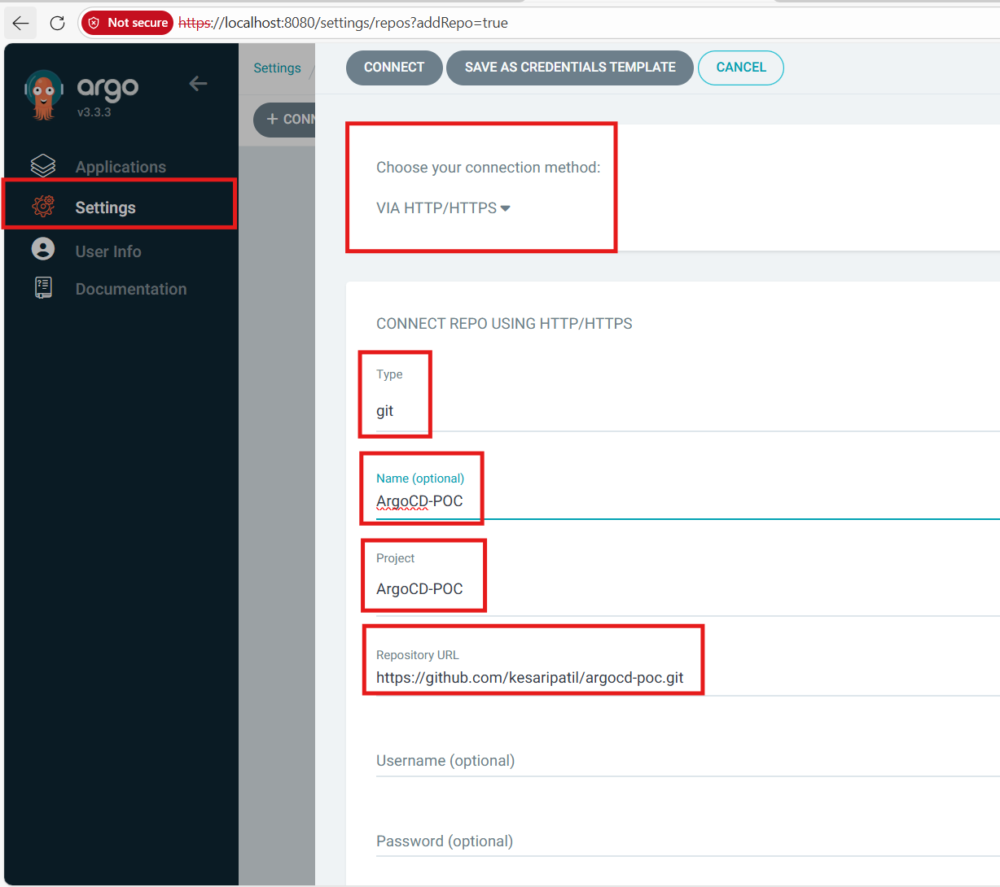
Successful connection:
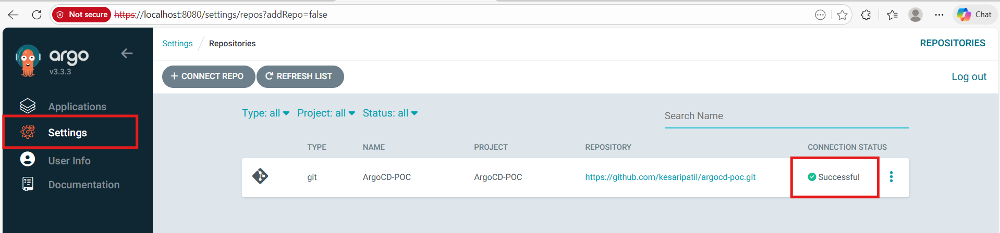

## ✅ 7. Create an Argo CD Application
### 7.1 Go to:
Applications → New App
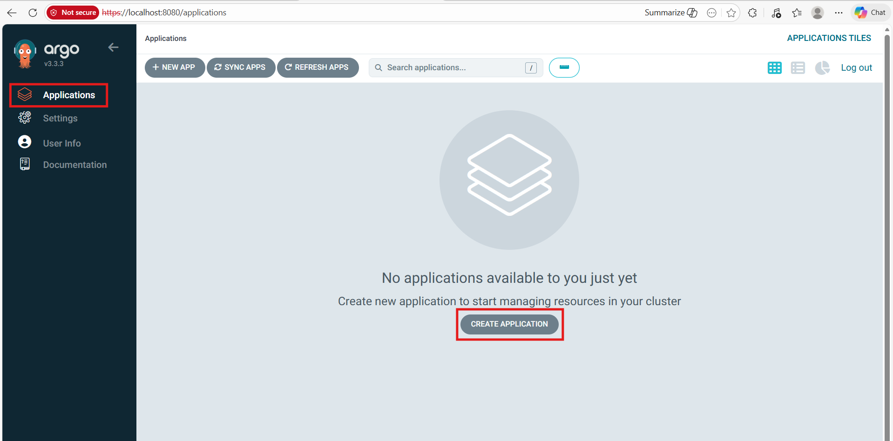
### 7.2 Enter application details
Enter app & project name:
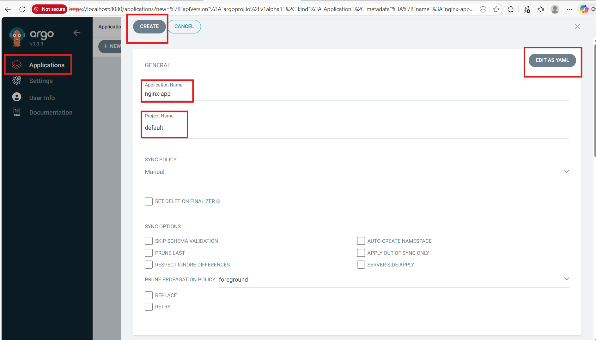
Select source & destination:
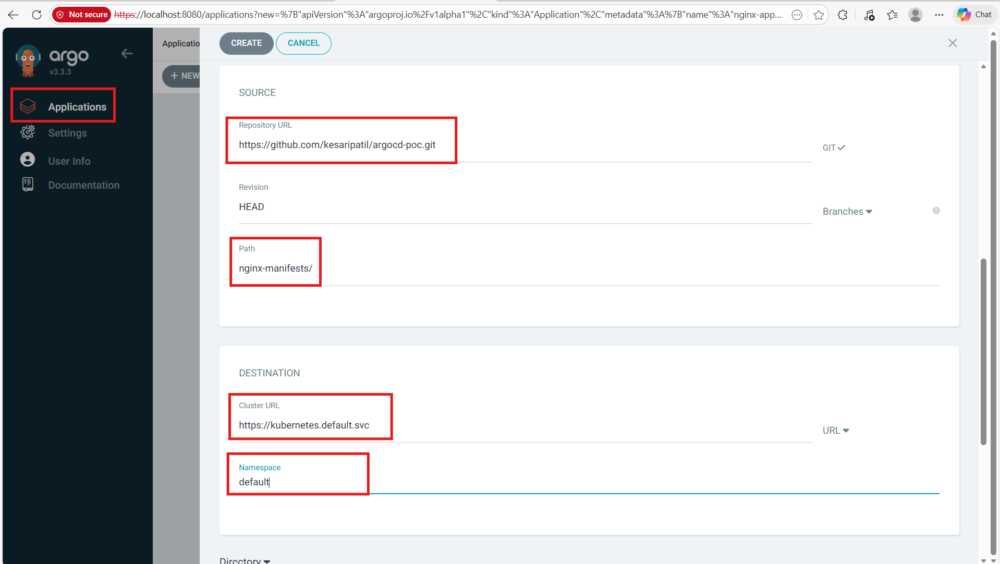

## ✅ 8. Sync the Application
Initial OutOfSync state:
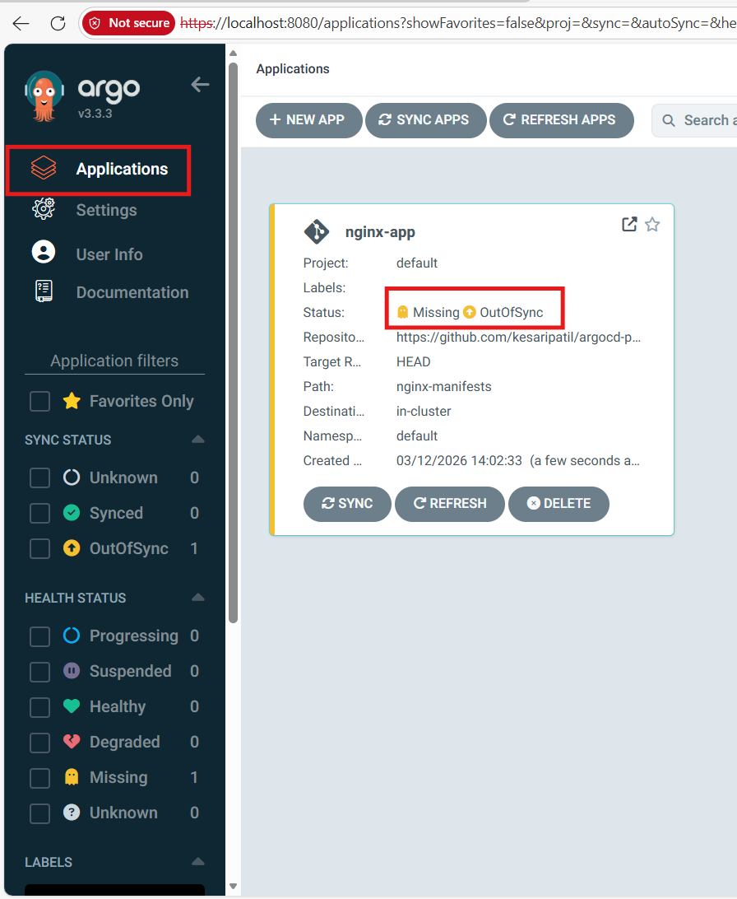
Click SYNC:
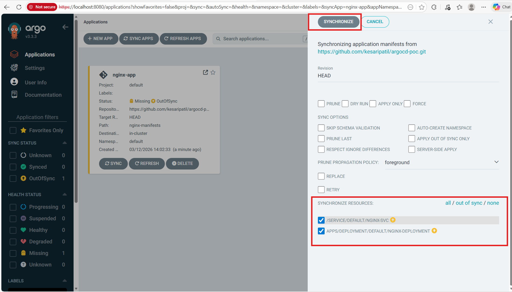
Healthy & Synced:
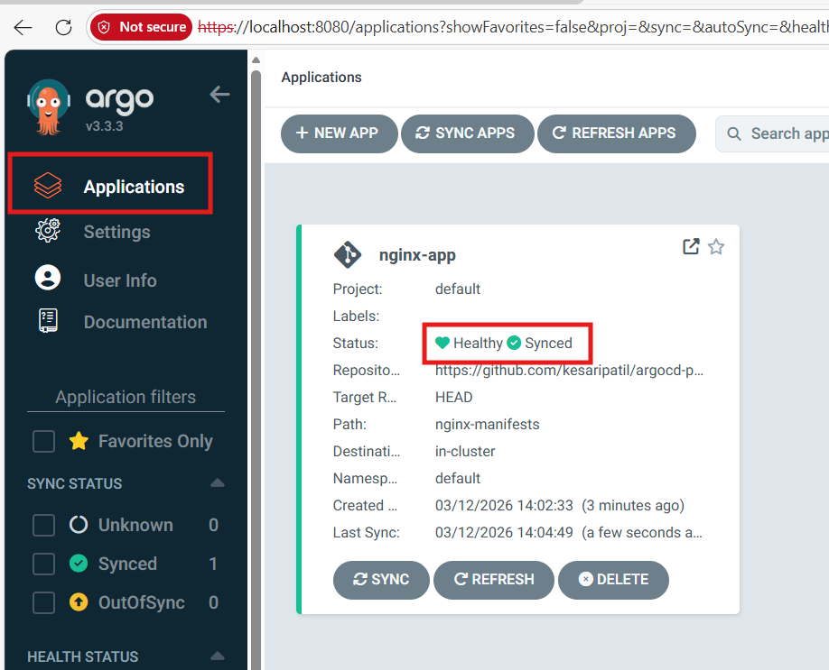

## ✅ 9. Verify Deployment
```
kubectl get po -n default
```
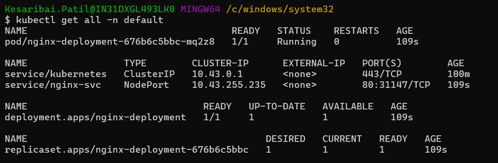

## ✅ 10. Access the NGINX Application
Port-forward:
```
kubectl port-forward svc/nginx-service -n default 8081:80
```
Open:
http://localhost:8081


## 🎉 Done!
You now have:
- ✅ A k3d Kubernetes cluster
- ✅ Argo CD installed and running
- ✅ Git repository connected
- ✅ NGINX application deployed through GitOps
